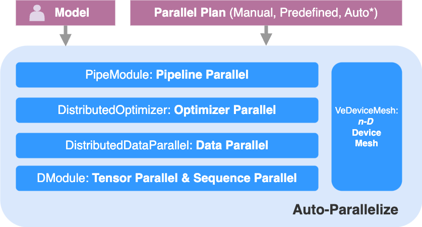

# veScale Parallel Overview

The overview of veScale n-D parallelsim is as follows:

(`*` is under development)

The _Auto-Parallelize_ block takes the untouched _Model_ from the user and _Parallel Plan_ (given by manual effort, prefined for each model type, or automatically generated from _Auto-Plan*_) and then parallelizes the single-device model into n-D parallelsim across a mesh of devices. 

veScale's n-D parallelism follows a decoupled design where each D of parallelism is handled by an independent sub-block (e.g., _DModule_ only handles _Tensor & Sequence Parallel_, without coupling with other _Parallel_). 
In contrast to a coupled design that intertwining all parallelism togather, such a decoupled n-D parallelism enjoys composability, debuggability, explanability, and extensibility.

## 4D Parallelsim API

For example of 4D parallelism (_Tensor, Sequence, Data, and ZeRO2_), our API is as follows:

## 5D Parallelsim API

Coming Soon

# TODO: grammer check